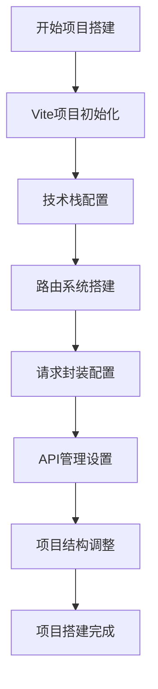

## 1. 产品概述

基于React+TypeScript+Vite的前端项目脚手架，提供完整的开发环境配置和基础架构。适用于需要快速搭建现代化前端项目的开发团队。

## 2. 核心功能

### 2.1 项目初始化功能

提供标准化的项目创建流程，包含技术栈配置、路由系统、请求封装等核心功能模块。

### 2.2 开发环境配置

集成现代化的开发工具和框架，包括状态管理、UI组件库、路由管理等，确保开发效率和代码质量。

### 2.3 项目架构规范

建立清晰的项目目录结构和代码组织规范，便于团队协作和项目维护。

### 2.2 功能模块

项目包含以下核心功能模块：

1. **项目初始化**：Vite项目创建和基础配置
2. **技术栈配置**：React、TypeScript、状态管理、UI组件库集成
3. **路由系统**：React Router配置和页面导航
4. **请求封装**：Axios实例封装和HTTP请求管理
5. **API管理**：接口模块化管理和统一导出
6. **项目结构**：标准化的目录结构和文件组织

### 2.3 页面详情

| 页面名称  | 模块名称   | 功能描述                                     |
| ----- | ------ | ---------------------------------------- |
| 项目初始化 | Vite配置 | 创建React+TypeScript项目，跳过ESLint和Prettier配置 |
| 技术栈配置 | 依赖安装   | 安装和配置zustand、Ant Design及相关依赖             |
| 路由配置  | 路由系统   | 配置react-router-dom，创建基础路由结构              |
| 请求封装  | HTTP工具 | 封装axios实例，配置请求拦截器和基础设置                   |
| API管理 | 接口模块   | 按功能模块划分API接口，统一导出管理                      |
| 项目结构  | 目录组织   | 建立清晰的src目录结构，包含api、router、utils等         |

## 3. 核心流程

用户按照以下流程完成项目搭建：

1. 执行Vite项目初始化命令
2. 安装和配置核心技术依赖
3. 搭建路由系统和页面导航
4. 配置HTTP请求封装
5. 建立API接口管理规范
6. 完善项目目录结构



## 4. 用户界面设计

### 4.1 设计规范

* **技术栈**：React 18 + TypeScript + Vite

* **状态管理**：Zustand轻量级状态管理

* **UI组件库**：Ant Design组件体系

* **路由方案**：React Router DOM

* **HTTP客户端**：Axios请求库

### 4.2 项目结构规范

```
src/
├── api/          # API接口管理
├── router/       # 路由配置
├── utils/        # 工具函数
├── pages/        # 页面组件
├── components/   # 公共组件
├── stores/       # 状态管理
└── types/        # 类型定义
```

### 4.3 配置规范

* **开发环境**：支持热更新和快速构建

* **代码规范**：TypeScript严格模式

* **组件规范**：函数式组件+Hooks

* **状态管理**：按需创建store实例

* **样式方案**：支持CSS

