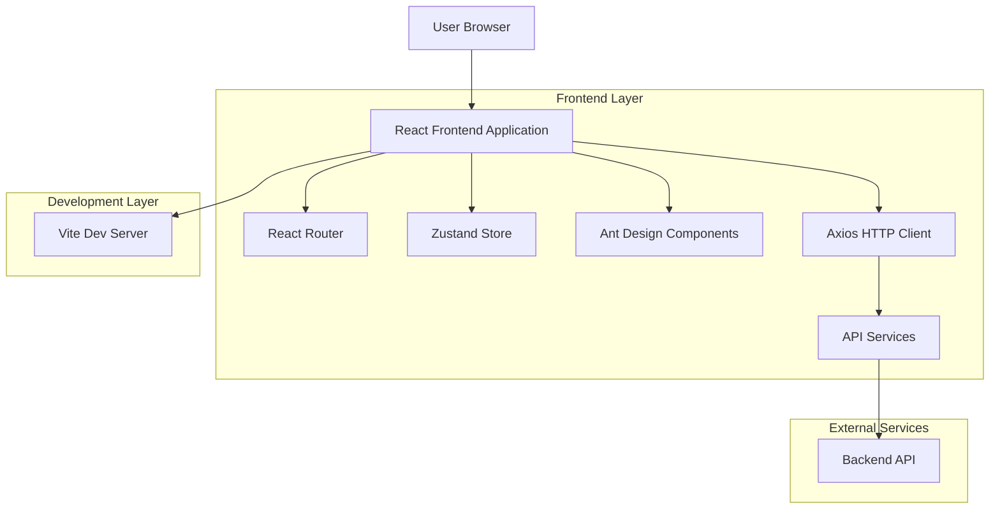

## 1. 架构设计



## 2. 技术栈描述

- **前端框架**: React@18 + TypeScript@5 + Vite@5
- **初始化工具**: vite-init
- **状态管理**: Zustand@4
- **UI组件库**: Ant Design@5 + @ant-design/icons
- **路由管理**: React Router DOM@6
- **HTTP客户端**: Axios@1
- **构建工具**: Vite + Babel插件

## 3. 路由定义

| 路由 | 用途 |
|------|------|
| / | 首页，项目主入口 |
| /login | 登录页面 |
| /dashboard | 仪表板页面 |
| /profile | 用户资料页面 |

## 4. 项目配置

### 4.1 Vite配置
```typescript
// vite.config.ts
import { defineConfig } from 'vite'
import react from '@vitejs/plugin-react'

export default defineConfig({
  plugins: [
    react({
      babel: {
        plugins: [
          ['import', {
            libraryName: 'antd',
            libraryDirectory: 'es',
            style: 'css'
          }]
        ]
      }
    })
  ],
  server: {
    port: 3000,
    open: true
  }
})
```

### 4.2 HTTP客户端配置
```typescript
// utils/http.ts
import axios from 'axios'

const http = axios.create({
  baseURL: import.meta.env.VITE_API_BASE_URL || '/api',
  timeout: 10000,
  headers: {
    'Content-Type': 'application/json'
  }
})

// 请求拦截器
http.interceptors.request.use(
  (config) => {
    // 添加认证token等
    return config
  },
  (error) => {
    return Promise.reject(error)
  }
)

// 响应拦截器
http.interceptors.response.use(
  (response) => {
    return response.data
  },
  (error) => {
    // 统一错误处理
    return Promise.reject(error)
  }
)

export default http
```

## 5. 项目结构

```
src/
├── api/                    # API接口管理
│   ├── user.ts            # 用户相关API
│   ├── auth.ts            # 认证相关API
│   └── index.ts           # API统一导出
├── router/                 # 路由配置
│   └── index.tsx          # 路由配置
├── utils/                  # 工具函数
│   └── http.ts            # HTTP请求封装
├── pages/                  # 页面组件
│   ├── Home/              # 首页
│   ├── Login/             # 登录页
│   └── Dashboard/         # 仪表板
├── components/             # 公共组件
│   ├── Layout/            # 布局组件
│   └── Common/            # 通用组件
├── stores/                 # 状态管理
│   └── user.ts            # 用户状态
└── types/                  # 类型定义
    └── index.ts           # 全局类型
```

## 6. 开发环境配置

### 6.1 环境变量
```bash
# .env.development
VITE_API_BASE_URL=http://localhost:3001/api
VITE_APP_TITLE=React Admin

# .env.production
VITE_API_BASE_URL=https://api.example.com
VITE_APP_TITLE=React Admin
```

### 6.2 依赖安装命令
```bash
# 项目初始化
pnpm create vite@latest . --template react-ts

# 核心依赖
pnpm add zustand antd @ant-design/icons axios react-router-dom

# 开发依赖
pnpm add -D babel-plugin-import

# 启动开发服务器
pnpm dev
```

### 6.3 构建配置
```json
// package.json
{
  "scripts": {
    "dev": "vite",
    "build": "tsc && vite build",
    "preview": "vite preview",
    "lint": "eslint . --ext ts,tsx --report-unused-disable-directives --max-warnings 0"
  }
}
```

## 7. 代码规范

### 7.1 组件规范
- 使用函数式组件和React Hooks
- 组件文件使用PascalCase命名
- 类型定义使用TypeScript接口

### 7.2 API管理规范
- 按功能模块划分API文件
- 统一使用封装的HTTP客户端
- 接口函数使用清晰的命名规范

### 7.3 状态管理规范
- 使用Zustand进行状态管理
- 按业务模块创建store
- 保持状态的单一数据源